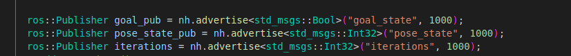

# Introduction

Robot FI Tool to inject faults into any robot please follow [this](https://github.com/SHARATHbhushan/robot_fault_injector_block.git) repository 

## Package Structure

this section briefly explains the structure of the package and explains customizationa options and some important folders.

- src
  - [robot_fi_tool](src/robot_fi_tool/): this package containes the fault injection module
    - [config](src/robot_fi_tool/config/): configuration files
    - [launch](src/robot_fi_tool/launch/): launch files
    - [msg](src/robot_fi_tool/msg/): custom message
    - [src](src/robot_fi_tool/src/): source code
    - [utils](src/robot_fi_tool/utils/): code for FI experiment
  

## Quick Start

## Requirements
- `sudo apt-get install qt5-default`
- `pip3 install -r requirements.txt`

## Install
- add required robot modules and its ROS support packages

## Controller setup 
we can use a moveit C++ robot controller this guide shows how to setup any robot controller to work with robot fault injector pakcage

- remap `joint_states` topic to `joint_states_fake`

- Create publisher and subsriber use the same topic as shown in the below figure.

- publish iterations: since the robot perform multiple iterations of a similar movement

- publish status message and state of the robot state here means the pose of the robot

- sleep for 5 seconds befor starting the moveit call

# start the simulation 

once the robot controller is setup launch the robot simulation.

## build the robot simulation package and robot fi module

`catkin build -j4 -DCMAKE_BUILD_TYPE=Release -DFranka_DIR:PATH=~/libfranka/build`

## Start simulation

- `source devel/setup.bash`
- `roslaunch panda_gazebo put_robot_in_world.launch`

## Start FI Module and person sim

- `roslaunch robot_fi_tool fault_module.launch`
- to inject fault using GUI: `rosrun robot_fi_module fib_gui_v2.py`

or 

## Start random FI Process

- random planning and execution: `roslaunch robot_fi_tool rand_fault_injector.launch`
- random real-time: `roslaunch robot_fi_tool real_time_rand_fault_injection.launch`

## FI Experiment

- `bash pipiline.sh`

this starts random fault injection experiment and saves the bag files into data_v4

